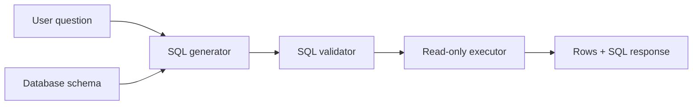

# Architecture

The project has four layers:

- Schema loader for table and column metadata.
- Text-to-SQL generator that maps natural language to schema-aware SQL.
- Validator that blocks unsafe SQL and unknown tables.
- Executor that runs read-only queries against SQLite.

## Production Path

The local generator is deterministic for demos and tests. The QLoRA script provides a training path for CodeLlama-style text-to-SQL models using schema-question-SQL triples.

